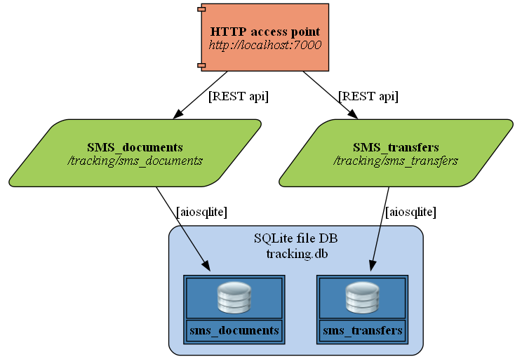

# fastapi_pytest

An FastAPI + SqlModel + pytest extravaganza example project.


It's a RESTful API that abstracts the usage of a relational database into
http calls to external users.

### Author: Anders Wiklund

The following techniques are incorporated and explained in the example:

* Using the Repository and the Dependency Injection design patterns.
* Using DB foreign key table linking with a cascading delete constraint.
* Using bulk `Upsert` techniques with SQLModel and alchemy ORM handling.
* Using colorized and unified logs with the same formatting for all components.
* Explains how and where to add OpenAPI documentation to enrich the user experience.
* How to get SQLModel to do validation even when the `table=True` flag is set.
* How to perform testing of the API without using the database.
* How to use test data for each test module from its own test data file.

## Published

This repository is covered in two **Medium** articles.

### Here's a brief outline of the article parts

#### [1. Introduction and explanations of the used techniques](https://medium.com/@wilde.consult/fastapi-sqlmodel-pytest-extravaganza-part1-c37fa84a2e97)
This part explains about the different techniques that are used in the example.

#### [2. Installing and exploring the example](https://medium.com/@wilde.consult/fastapi-sqlmodel-pytest-extravaganza-part2-12f276b5f844)
This part talks about installing and exploring the example, the MkDocs documentation and the code coverage testing.


### Installation

You can either download it as a zipped package or clone it using git, the choice is yours.

If you want to clone it, use the following command in a terminal:

```
$ git clone https://github.com/ycc140/fastapi_pytest.git fastapi_pytest
```

You need to configure the python environment for the example by creating a virtual environment,
called `.venv` under the *fastapi_pytest* directory by starting a terminal window in that
directory and issue the following command:

```
fastapi_pytest$ python -m venv .venv
```

Activate the environment in the command window like this (for Windows):

```
fastapi_pytest$ .venv\scripts\activate
```

If you are on Linux or macOS, you type:

```
fastapi_pytest$ source .venv/bin/activate
```

You can see it activated when (venv) is shown as a prefix in the command line prompt.

To run the example, we need to install the required third-party python packages.
They are specified in a requirements.txt file in the root of the example, install the file
by running the following command in the venv activated command window:

```
(venv)fastapi_pytest$ pip install -r requirements.txt
```

### Running the example

you run the example like this:

```
(venv)fastapi_pytest$ run.py
```

### Exploring the MkDocs documentation

If you want to look at the excellent documentation created using MkDocs, we need to install
the required third-party python packages.
They are specified in a requirements_mkdocs.txt file in the root of the example, install its
requirements like this:

```
(venv)fastapi_pytest$ pip install -r requirements_mkdocs.txt
```

MkDocs is run from the root directory like this:

```
(venv)fastapi_pytest$ mkdocs serve
```
