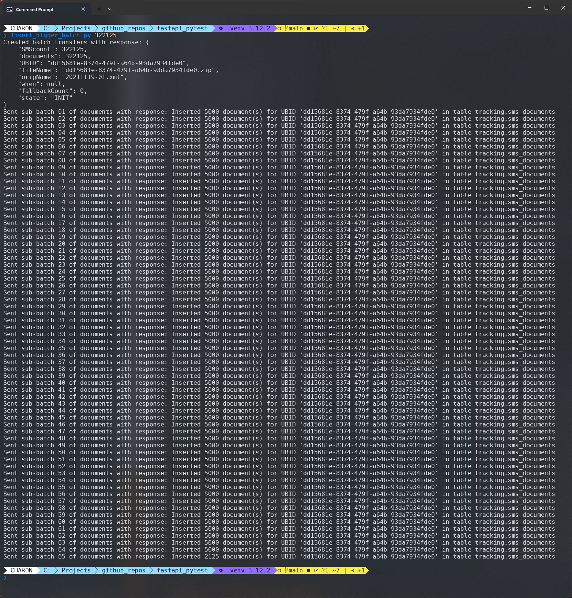

No database can INSERT an infinite number of rows. For that reason, there's often imposed
a bulk limit. In this example, I have set it to 5000 SMS batch documents. If you want to
insert more documents than that, you have to split your batch into smaller chunks, so it can
pass under the limit.

I have written a small script that does that. It can insert any number of SMS documents.
As part of creating this example, I tested with 412,343 documents in a batch, it took 22 seconds,
and the result looked similar to this:

[](images/bauta_batch_creation.png "Click to enlarge")

There's some good python code in there, I did learn some new stuff when I was developing the code,
and I thought that some of it might interest you too.

### creating sub-batches

The design idea behind it all is to create the sub-batches from the start when I create the fake data.
The document models that handle this are:

``` py linenums="1" hl_lines="12" title="snippet from: app/sms_document/models.py"
class SmsDocumentItem(SQLModel):
    data: dict
    SMScount: PositiveInt
    UBID: Optional[str] = None
    uniqueId: str = Field(max_length=10)


class SmsDocumentPayload(SQLModel):
    model_config = ConfigDict(json_schema_extra={"example": payload_documentation})

    UBID: str = Field(max_length=36)
    documents: List[SmsDocumentItem] = Field(max_length=5000)
```

The highlighted line 12 shows the set batch limit, and you can see the document list
declaration as well.

What makes it a bit confusing is that UBID exists in two places. It's not the best design,
it's a tradeoff to reduce payload size between sender and API endpoint. As an example, the UBID memory
size is 89 bytes. If you add that size to the 412,343 documents, you increase the payload size by a
whooping 36 Mb totally (0.5 Mb per sub-batch)! So, the tradeoff is acceptable in my eyes.

The reason that UBID exists in the `SmsDocumentItem` model is to simplify the database INSERT operation.

The code that creates the document data and splits it into sub-batches is shown below.

Note that this is a generator function (it's using yield). One big benefit of this is that the
user of this generator doesn't allocate the whole SMS batch into memory (that what's happening
when you are iterating over a list). Instead only one sub-batch per iteration is allocated.

The first highlight shows the sub-batch split calculation, together with the bsub-batch yield.

The second highlight shows the yield for the "dangling" documents.

``` py linenums="1" hl_lines="9-10 26" title="snippet from: insert_bigger_batch.py"
def generate_documents(batch_size: int, ubid: str) -> tuple:
    batch = 1
    documents = []

    for idx in range(batch_size):
        docid = idx + 1
        key = f'{docid:010}'

        if idx > 0 and idx % API_BATCH_LIMIT == 0:
            yield batch, documents
            documents = []
            batch += 1

        document = {
            "SMScount": 1,
            "uniqueId": key,
            "data": {
                "source": "DentalCare",
                "refId": f"{ubid}.{key}",
                "destination": f"+01708{key}",
                "userData": "Welcome to your..."}}
        documents.append(document)

    # Return remaining documents that are
    # left after the last iteration.
    yield batch, documents
```

The loop shows the iteration over the sub-batches and creating a task to send the sub-batch
to the API.

``` py linenums="1" title="snippet from: insert_bigger_batch.py"
async def creator(args: argparse.Namespace):
    ubid = await create_and_insert_batch_transfer(args.batch_size)

    async with AsyncClient() as client:
        for batch_id, documents in generate_documents(args.batch_size, ubid):
            payload = {"UBID": ubid, "documents": documents}
            await asyncio.create_task(
                send_sms_batch_documents(client, batch_id, payload)
            )
```

On the API side it drills down to the CRUD `create` method, which look like this:

``` py linenums="1" hl_lines="3-4 8" title="snippet from: app/sms_document/sms_document_crud.py"
    async def create(self, payload: SmsDocumentPayload) -> int:

        for document in payload.documents:
            document.UBID = payload.UBID

        query = (
            upsert(SmsDocumentModel)
            .values(payload.model_dump()['documents'])
            .on_conflict_do_update(
                index_elements=['UBID', 'uniqueId'],
                set_=dict(
                    state=SmsDocumentState.INIT,
                    when=func.current_timestamp())
            )
        )
        response: CursorResult = await self.session.exec(query)
        await self.session.commit()
        return response.rowcount
```

The first highlight shows the code that adds the UBID in all the batch documents in the
`SmsDocumentItem` model. The second highlight shows how the batch documents are added to the query.
It's not the best design since the `create` method needs have some knowledge of the overall design,
but some tradeoffs you can live with.
